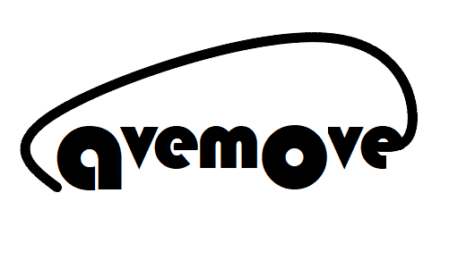

<!-- Improved compatibility of back to top link: See: https://github.com/othneildrew/Best-README-Template/pull/73 -->
<a id="readme-top"></a>
<!--
*** Thanks for checking out the Best-README-Template. If you have a suggestion
*** that would make this better, please fork the repo and create a pull request
*** or simply open an issue with the tag "enhancement".
*** Don't forget to give the project a star!
*** Thanks again! Now go create something AMAZING! :D
-->


<!-- PROJECT SHIELDS -->
<!--
*** I'm using markdown "reference style" links for readability.
*** Reference links are enclosed in brackets [ ] instead of parentheses ( ).
*** See the bottom of this document for the declaration of the reference variables
*** for contributors-url, forks-url, etc. This is an optional, concise syntax you may use.
*** https://www.markdownguide.org/basic-syntax/#reference-style-links
-->
<!-- [![Contributors][contributors-shield]][contributors-url]
[![Forks][forks-shield]][forks-url]
[![Stargazers][stars-shield]][stars-url]
[![Issues][issues-shield]][issues-url]
[![MIT License][license-shield]][license-url]
[![LinkedIn][linkedin-shield]][linkedin-url] -->


<!-- PROJECT LOGO -->
<br />
<div align="center">
  <a href=https://github.com/SPL-FORTH-ICS/CAVEMOVE>
    
  </a>

  <h3 align="center">CAVEMOVE</h3>

  <p align="center">
    <!-- <br />
    <a href="https://github.com/othneildrew/Best-README-Template"><strong>Explore the docs »</strong></a>
    <br /> -->
    Acoustic data collection for speech enabled technologies in moving vehicles.
    <br />
    <a href="https://github.com/SPL-FORTH-ICS/CAVEMOVE/blob/main/source/api-documentation.md">API Documentation</a>
    ·
    <a href="https://github.com/SPL-FORTH-ICS/CAVEMOVE/blob/main/source/dataset-documentation.pdf">Dataset Documentation</a>
    ·
    <a href="https://github.com/SPL-FORTH-ICS/CAVEMOVE/blob/main/CAVEMOVE_demo.ipynb">View Demo</a>
    ·
    <a href="https://github.com/SPL-FORTH-ICS/CAVEMOVE/issues/new?labels=bug&template=bug-report---.md">Report Bug</a>
    ·
    <a href="https://github.com/SPL-FORTH-ICS/CAVEMOVE/issues/new?labels=enhancement&template=feature-request---.md">Request Feature</a>
  
  </p>
</div>


<!-- TABLE OF CONTENTS -->
<details>
  <summary>Table of Contents</summary>
  <ol>
    <li>
      <a href="#about-the-project">About The Project</a>
    </li>
    <li>
      <a href="#getting-started">Getting Started</a>
      <ul>
        <li><a href="#prerequisites">Prerequisites</a></li>
        <li><a href="#installation">Installation</a></li>
      </ul>
    </li>
    <li><a href="#quick-start">Quick Start</a></li>
    <!-- <li><a href="#roadmap">Roadmap</a></li> -->
    <li><a href="#documentation">Documentation</a></li>
    <li><a href="#contributing">Contributing</a></li>
    <li><a href="#license">License</a></li>
    <li><a href="#contact">Contact</a></li>
    <li><a href="#acknowledgments">Acknowledgments</a></li>
  </ol>
</details>


<!-- ABOUT THE PROJECT -->
## About The Project
CAVEMOVE is a research project dedicated to the collection of audio data for the study of voice enabled technologies inside moving vehicles. The recording process involves (i) recordings of acoustic impulse responses, which are acquired at static conditions and provide the means for modeling the speech and car-audio components and (ii) recordings of acoustic noise at a wide range of both static and in-motion conditions. Data are recorded with two different microphone configurations and particularly (i) a compact circular microphone array or (ii) a distributed microphone setup. 

This document explains the Application Programming Interface (API) that was designed in the context of CAVEMOVE. Using CAVEMOVE data and API, the user can easily synthesize the microphone signals required for research on voice enabled technologies, mainly by mixing speech components with noise components. Note that for this API to be useful, you must first download the open access audio data from zenodo following this [link](https://zenodo.org/records/13594243). In Zenodo, we also provide a detailed description of the driving conditions under which the audio recordings were obtained.

CAVEMOVE API is currently available in python, and relies only on basic python sound processing packages (librosa, numpy, scipy) and natsort. A Matlab version will soon follow. Some basic principles followed in CAVEMOVE are the following. 
- We provide functions for retrieving speech and noise components as separate python entities (numpy arrays). Users must manually add the speech and noise components to derive a mixture.
- Noise recordings are derived as a function of driving conditions, mainly the speed (in km/hour) and the window aperture (3 or 4 different windows conditions are considered in each vehicle)
- Apart from the basic noise components, we also provide means for adding ventilation/air-condition noise and also, interference from the built-in car audio system (e.g. radio, cd player etc)
- To produce the speech components, users must provide their own dry speech recordings 
- To produce the car-audio components, users must provide their own audio signals.

For any questions with respect to CAVEMOVE dataset or API, feel free to send an email to 
Andreas Symiakakis at  andrysmi [at] ics.forth.gr 
or
Nikos Stefanakis at nstefana [at] ics.forth.gr

CAVEMOVE project is funded by the Institute of Computer Science of the Foundation for Research and Technology-Hellas (FORTH).


<p align="right">(<a href="#readme-top">back to top</a>)</p>


<!-- ### Built With

This section should list any major frameworks/libraries used to bootstrap your project. Leave any add-ons/plugins for the acknowledgements section. Here are a few examples.

* [![Next][Next.js]][Next-url]
* [![React][React.js]][React-url]
* [![Vue][Vue.js]][Vue-url]
* [![Angular][Angular.io]][Angular-url]
* [![Svelte][Svelte.dev]][Svelte-url]
* [![Laravel][Laravel.com]][Laravel-url]
* [![Bootstrap][Bootstrap.com]][Bootstrap-url]
* [![JQuery][JQuery.com]][JQuery-url]
* [![Python][https://www.python.org/]][python-url]

<p align="right">(<a href="#readme-top">back to top</a>)</p> -->


<!-- GETTING STARTED -->
## Getting Started
### Prerequisites

* A ```python 3.11``` enviroment .

### Installation

1. Clone the repo
   ```sh
   git clone https://github.com/SPL-FORTH-ICS/CAVEMOVE
   ```

2. Download CAVEMOVE dataset from [Zenodo](https://zenodo.org/records/13594243) and extract folders.


3. Install dependancies
   ```sh
   pip install -r source/requirements.txt
   ```

4. Change git remote url to avoid accidental pushes to base project
   ```sh
   git remote set-url origin github_username/repo_name
   git remote -v # confirm the changes
   ```

<p align="right">(<a href="#readme-top">back to top</a>)</p>


<!-- QUICKSTART -->
## Quick Start

```python
from Car import Car
import os
import librosa
import soundfile as sf

dataset_path = 'path/to/cavemove/dataset'
car_names = ['Volkswagen_Golf', 'AlfaRomeo_146', 'Smart_forfour']
car_path = os.path.join(dataset_path, car_names[0])
radio_path = 'path/to/radio.wav'
voice_path = '/path/to/voice.wav'

sampling_rate = 16000  # open access data is provided at 16kHz sampling rate
my_mic_setup = 'array'
my_location = 'd50'
my_speed = 50
my_window = 1
my_Ls = 70
my_La = 60
my_mics = [0, 1, 2, 3, 4, 5, 6, 7]
my_vent_level = 1
my_car = Car(path=car_path, fs=sampling_rate)

#%% Get noise component
n = my_car.get_noise(mic_setup=my_mic_setup, speed=my_speed, window=my_window, mics=my_mics)
#%% Get speech component
dry_voice, fs_dry_voice = librosa.load(voice_path, sr=my_car.fs, mono=True)
s = my_car.get_speech(mic_setup=my_mic_setup, location=my_location,
                      window=my_window, ls=my_Ls, dry_speech=dry_voice, mics=my_mics)
#%% Get radio component
radio_tune, fs_radio = librosa.load(radio_path, sr=my_car.fs, mono=True)
a = my_car.get_radio(mic_setup=my_mic_setup, window=my_window,
                     la=my_La, radio_audio=radio_tune, mics=my_mics)

#%% Get ventilation noise component
v = my_car.get_ventilation(mic_setup=my_mic_setup, window=my_window, level=my_vent_level, mics=my_mics)

#%% Match duration of components to speech duration
[s_new, a_new, v_new, n_new] = Car.match_duration([s, a, v, n], my_car.fs)

#%%  add components to produce a mix
mix = s_new + a_new + v_new + n_new


#%% Finally, get_components can return all the above components or cominations of those, in matched duration.by providing te correspodins arguments. See Documentation for more info
components = my_car.get_components(mic_setup=my_mic_setup, location=my_location, speed=my_speed, 
                                   window=my_window, mics=my_mics, ls=my_Ls, dry_speech=dry_voice,
                                   la=my_La, radio_audio=radio_tune, vent_level=1)

#%% export selected microphone channel as a wav file
sf.write('mix.wav', mix[:,0], my_car.fs)
```

_For more examples, please refer to the [Documentation](https://github.com/SPL-FORTH-ICS/CAVEMOVE/blob/main/source/documentation.md) or to the [CAVEMOVE demo](https://github.com/SPL-FORTH-ICS/CAVEMOVE/blob/main/CAVEMOVE_demo.ipynb)._

<p align="right">(<a href="#readme-top">back to top</a>)</p>

<!-- DOCUMENTATION -->
## Documentation
For extensive documentation for the API refer to [documentation.md](https://github.com/SPL-FORTH-ICS/CAVEMOVE/blob/main/source/api-documentation.md) file. As described in the <a href="#about-the-project">About The Project</a> section, this API accompanies a specific dataset. Please refer to the <a href="https://github.com/SPL-FORTH-ICS/CAVEMOVE/blob/main/source/dataset-documentation.pdf">Dataset Documentation</a> file for information regarding naming conventions etc.


<p align="right">(<a href="#readme-top">back to top</a>)</p>
<!-- ROADMAP -->
<!-- ## Roadmap

- [x] Add Changelog
- [x] Add back to top links
- [ ] Add Additional Templates w/ Examples
- [ ] Add "components" document to easily copy & paste sections of the readme
- [ ] Multi-language Support
    - [ ] Chinese
    - [ ] Spanish

See the [open issues](https://github.com/SPL-FORTH-ICS/CAVEMOVE/issues) for a full list of proposed features (and known issues).

<p align="right">(<a href="#readme-top">back to top</a>)</p> -->


<!-- CONTRIBUTING -->
## Contributing

Contributions are what make the open source community such an amazing place to learn, inspire, and create. Any contributions you make are **greatly appreciated**.

If you have a suggestion that would make this better, please fork the repo and create a pull request. You can also simply open an issue with the tag "enhancement".
Don't forget to give the project a star! Thanks again!

1. Fork the Project
2. Create your Feature Branch (`git checkout -b feature/AmazingFeature`)
3. Commit your Changes (`git commit -m 'Add some AmazingFeature'`)
4. Push to the Branch (`git push origin feature/AmazingFeature`)
5. Open a Pull Request

### Top contributors:

<a href="https://github.com/SPL-FORTH-ICS/CAVEMOVE/graphs/contributors">
  
</a>

Made with [contrib.rocks](https://contrib.rocks).
<p align="right">(<a href="#readme-top">back to top</a>)</p>


<!-- LICENSE -->
## License

Distributed under the MIT License. See [LICENSE](https://github.com/SPL-FORTH-ICS/CAVEMOVE/blob/main/source/LICENSE) for more information.

<p align="right">(<a href="#readme-top">back to top</a>)</p>


<!-- CONTACT -->
## Contact

Nikolaos Stefanakis - nstefana [at] ics.forth.gr\
Andreas Symiakakis - andrsymi [at] ics.forth.gr

Project Link: [https://github.com/SPL-FORTH-ICS/CAVEMOVE/](https://github.com/SPL-FORTH-ICS/CAVEMOVE/)

<p align="right">(<a href="#readme-top">back to top</a>)</p>


<!-- ACKNOWLEDGMENTS -->
## Acknowledgments

<!-- Use this space to list resources you find helpful and would like to give credit to. I've included a few of my favorites to kick things off!

* [Choose an Open Source License](https://choosealicense.com)
* [GitHub Emoji Cheat Sheet](https://www.webpagefx.com/tools/emoji-cheat-sheet)
* [Malven's Flexbox Cheatsheet](https://flexbox.malven.co/)
* [Malven's Grid Cheatsheet](https://grid.malven.co/)
* [Img Shields](https://shields.io)
* [GitHub Pages](https://pages.github.com)
* [Font Awesome](https://fontawesome.com)
* [React Icons](https://react-icons.github.io/react-icons/search)

<p align="right">(<a href="#readme-top">back to top</a>)</p> -->
CAVEMOVE project is funded by the Institute of Computer Science of the Foundation for Research and Technology-Hellas (FORTH).

<p align="right">(<a href="#readme-top">back to top</a>)</p>


<!-- MARKDOWN LINKS & IMAGES -->
<!-- https://www.markdownguide.org/basic-syntax/#reference-style-links -->
<!-- [contributors-shield]: https://img.shields.io/github/contributors/othneildrew/Best-README-Template.svg?style=for-the-badge
[contributors-url]: https://github.com/othneildrew/Best-README-Template/graphs/contributors
[forks-shield]: https://img.shields.io/github/forks/othneildrew/Best-README-Template.svg?style=for-the-badge
[forks-url]: https://github.com/othneildrew/Best-README-Template/network/members
[stars-shield]: https://img.shields.io/github/stars/othneildrew/Best-README-Template.svg?style=for-the-badge
[stars-url]: https://github.com/othneildrew/Best-README-Template/stargazers
[issues-shield]: https://img.shields.io/github/issues/othneildrew/Best-README-Template.svg?style=for-the-badge
[issues-url]: https://github.com/othneildrew/Best-README-Template/issues
[license-shield]: https://img.shields.io/github/license/othneildrew/Best-README-Template.svg?style=for-the-badge
[license-url]: https://github.com/othneildrew/Best-README-Template/blob/master/LICENSE.txt
[linkedin-shield]: https://img.shields.io/badge/-LinkedIn-black.svg?style=for-the-badge&logo=linkedin&colorB=555
[linkedin-url]: https://linkedin.com/in/othneildrew
[product-screenshot]: images/screenshot.png
[Next.js]: https://img.shields.io/badge/next.js-000000?style=for-the-badge&logo=nextdotjs&logoColor=white
[Next-url]: https://nextjs.org/
[React.js]: https://img.shields.io/badge/React-20232A?style=for-the-badge&logo=react&logoColor=61DAFB
[React-url]: https://reactjs.org/
[Vue.js]: https://img.shields.io/badge/Vue.js-35495E?style=for-the-badge&logo=vuedotjs&logoColor=4FC08D
[Vue-url]: https://vuejs.org/
[Angular.io]: https://img.shields.io/badge/Angular-DD0031?style=for-the-badge&logo=angular&logoColor=white
[Angular-url]: https://angular.io/
[Svelte.dev]: https://img.shields.io/badge/Svelte-4A4A55?style=for-the-badge&logo=svelte&logoColor=FF3E00
[Svelte-url]: https://svelte.dev/
[Laravel.com]: https://img.shields.io/badge/Laravel-FF2D20?style=for-the-badge&logo=laravel&logoColor=white
[Laravel-url]: https://laravel.com
[Bootstrap.com]: https://img.shields.io/badge/Bootstrap-563D7C?style=for-the-badge&logo=bootstrap&logoColor=white
[Bootstrap-url]: https://getbootstrap.com
[JQuery.com]: https://img.shields.io/badge/jQuery-0769AD?style=for-the-badge&logo=jquery&logoColor=white
[JQuery-url]: https://jquery.com 

[pyhton-url]: https://www.python.org/ -->

